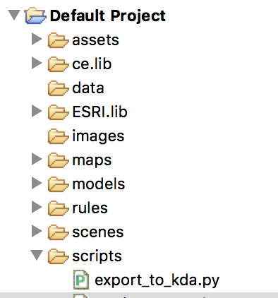
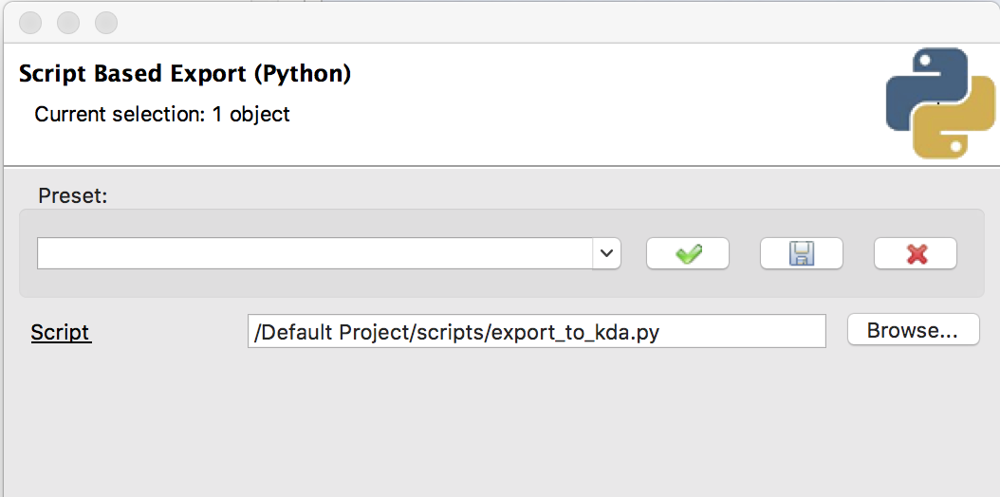
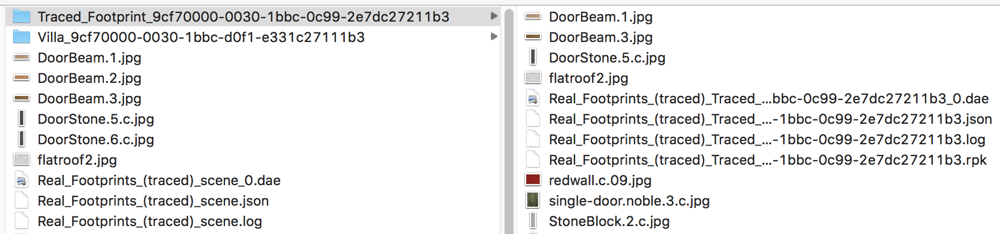

# Workflow 1

This workflow exports generated objects from CityEngine to be used with the Keeping Data Alive repository.

**Contents**

- [Installation](#installation)
- [Scene Preparation](#scene-preparation)
- [Export](#export)
- [Output](#output)
- [Troubleshooting](#troubleshooting)

## Installation

Open the CityEngine Navigator pane.  Download the export_to_kda.py script and drag it into the workspace's "scripts" directory.  Select "Copy files" when a dialogue box appears. The script was designed to rely on only modules available by default within the CityEngine python environment, so no further installation steps are required.

## Scene Preparation

The script generates objects which were procedurally generated as "shapes" in CityEngine.  A user can hand draw some footprints or import a shapefile.  Select one or more footprints, apply rules, and generate the structures.  Optionally, but encouraged, apply or enter specific names for each of the structures that will be exported.  Finally, select those objects which will be exported.

## Export

Navigate to "File" > "Export Models…" and select "Script Based Export (Python)."  Browse for `export_to_kda.py`.

When "Finish" is selected, the script will begin to execute.  First, it creates a directory in the "models" directory of the current project in which it will save all the exported files.  This directory is currently named after the layer of the first object, but the naming convention may need to be considered in more depth as further work is done in the future.  Then, the script iterates through each of the distinct structures (considered "shapes" by CityEngine).  For each object, it creates a subdirectory and creates several files inside.  Finally, the script creates files for the entire group of objects, what KDA refers to as the "scene."

## Output

Upon a successful run, the script will have generated a directory with a layer name, a COLLADA (.dae) file, JSON file, export log, and assets, as well as subdirectories for each object with similar contents and an additional file described later, an RPK.

## Troubleshooting

CityEngine's python error handling tends to silently fail instead of raising an exception.  Despite the lack of obvious errors, it may be helpful to open the CityEngine console to watch the script's output.  In the event that the RPK fails to be created based on improperly formed CGA rules, an error will be printed to the console and execution of the script continues.  Additionally, if there is a problem with the exporter itself, CityEngine will display the exporting wizard for the user to manually navigate.
